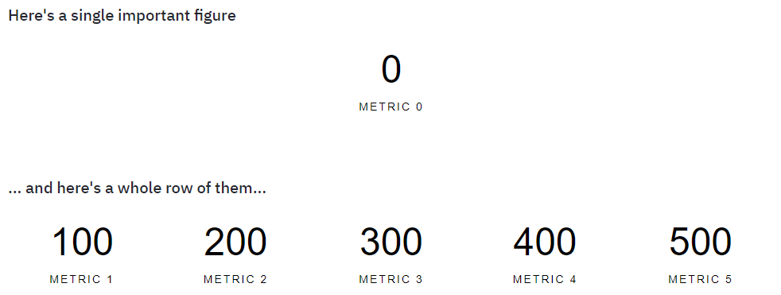

A Streamlit component for displaying important figures.



## Installation

```python
pip install streamlit-metrics
```

## Usage

```python
import streamlit as st
from streamlit_metrics import metric, metric_row

st.write('## Here's a single figure')
metric("Metric 0", 0)

st.write('## ... and here's a row of them')
metric_row(
    {
        "Metric 1": 100,
        "Metric 2": 200,
        "Metric 3": 300,
        "Metric 4": 400,
        "Metric 5": 500,
    }
)
```
